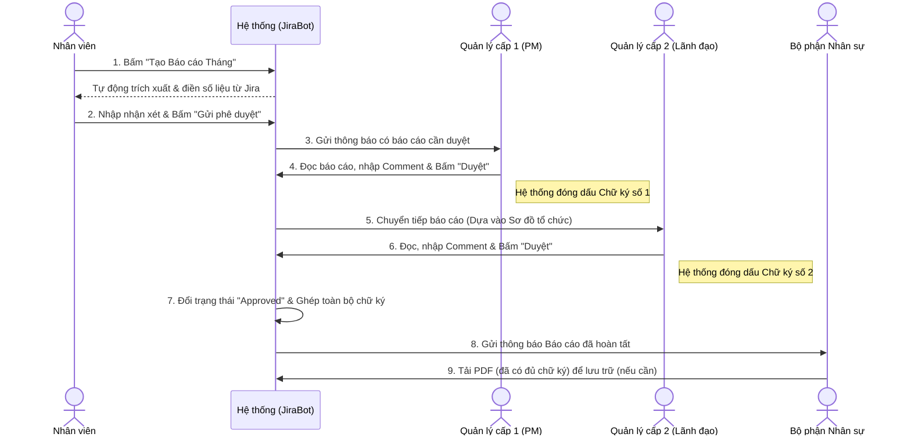

# ĐỀ XUẤT GIẢI PHÁP: SỐ HÓA BÁO CÁO THÁNG & QUẢN LÝ WORKLOAD

Tài liệu này định hướng lộ trình nâng cấp công cụ JiraBot hiện tại, tập trung giải quyết triệt để vấn đề rườm rà trong quy trình xuất báo cáo cuối tháng và cung cấp công cụ theo dõi khối lượng công việc (workload) của đội ngũ.

---

## 🎯 Tầm nhìn chiến lược (Vision)
Xóa bỏ hoàn toàn quy trình báo cáo thủ công (xuất Word, in ấn, xin chữ ký tay, scan file). Thay vào đó là một luồng phê duyệt trực tuyến xuyên suốt, đồng thời cung cấp cho cấp Quản lý/Sếp công cụ để kiểm soát chính xác workload thực tế của từng nhân sự dựa trên dữ liệu từ Jira.

---

## 📍 Giai đoạn 1: Số hóa Báo cáo Tháng & Trình ký Điện tử (Digital Reporting & Approval)
*Mục tiêu: Đưa toàn bộ quy trình làm báo cáo, nhận xét và xin chữ ký lên hệ thống online.*

- **Khởi tạo Báo cáo Tự động**: Nhân viên chỉ cần ấn nút "Tạo Báo cáo Tháng", hệ thống tự động trích xuất các metrics từ Jira (số giờ làm, task hoàn thành, bug) vào form chuẩn trên web. Nhân viên chỉ cần điền thêm nhận xét cá nhân.
- **Khai báo Chữ ký số (Signature Management)**: Mỗi cá nhân (đặc biệt là cấp Quản lý) có màn hình riêng để tải lên hình ảnh chữ ký của mình hoặc ký trực tiếp trên màn hình. Chữ ký này được mã hóa bảo mật và gắn liền với tài khoản của họ.
- **Phân quyền & Sơ đồ tổ chức (Org Tree)**: Xây dựng cơ chế cấu hình cấp quản lý trực tiếp (ai quản lý ai) để hệ thống biết chính xác báo cáo cần gửi cho những PM/Sếp nào duyệt.
- **Trình ký Đa cấp (Multi-level Workflow)**: 
  - Báo cáo tự động được luân chuyển đến các Sếp/PM theo Sơ đồ tổ chức.
  - Các Sếp nhận thông báo, vào xem, để lại **Nhận xét (Comments)** và ấn **Duyệt (Approve)** ngay trên hệ thống. 
  - Nút Duyệt sẽ tự động "đóng dấu" chữ ký số cá nhân (đã khai báo ở trên) cùng mốc thời gian duyệt (Timestamp) lên báo cáo.
- **Tự động lưu trữ & Thông báo**: Khi tất cả quản lý đã duyệt xong, báo cáo tự động chốt (Approved) và bộ phận HR sẽ nhận được thông báo để vào kiểm tra, không cần ai phải in hay scan gửi lại. Bản PDF xuất ra lúc này đã có sẵn hình ảnh chữ ký của tất cả các Sếp.

### 🔄 Biểu đồ Quy trình Trình ký (Workflow Diagram)

---

## 📍 Giai đoạn 2: Quản lý Workload & Năng suất (Workload & Capacity Tracking)
*Mục tiêu: Cung cấp góc nhìn thực tế về khối lượng công việc hiện tại và quá khứ của nhân viên.*

- **Dashboard Quản lý Workload (Dành cho PM/Sếp)**:
  - Xem được bức tranh tổng thể: Ai đang rảnh, ai đang bị quá tải (overload) dựa trên số lượng task, estimate time và time spent trên Jira.
  - Phân tích thời gian tiêu hao (Time Distribution): Nhìn ra được nhân viên đang dành nhiều thời gian cho việc code tính năng mới, hay đang tốn quá nhiều giờ để fix bug.
- **Cảnh báo thiếu/thừa giờ**: Tự động đánh dấu (highlight) các nhân sự chưa log đủ thời gian tiêu chuẩn trong ngày/tuần, hoặc những người thường xuyên log time OT (ngoài giờ).
- **Phân quyền Xem (View Permission)**: Đảm bảo PM chỉ xem được workload của thành viên trong team mình, trong khi Sếp/Director có thể xem toàn bộ công ty.

---

## 📍 Giai đoạn 3: Báo cáo Tổng hợp (Executive Dashboard)
*Mục tiêu: Báo cáo nhanh cho Ban lãnh đạo.*

- **Báo cáo toàn cảnh**: Tổng hợp tất cả báo cáo cá nhân của tháng thành một báo cáo duy nhất cho Ban giám đốc, nêu bật các cá nhân có năng suất xuất sắc hoặc dự án đang tiêu tốn nhiều nhân lực nhất.
- **Xuất PDF lưu vết (Khi cần)**: Mọi báo cáo dù đã số hóa vẫn có tùy chọn xuất ra file PDF hoàn chỉnh (gồm đầy đủ số liệu, nhận xét, thời gian duyệt của các Sếp) để in ấn lưu trữ nếu quy trình nội bộ bắt buộc.
